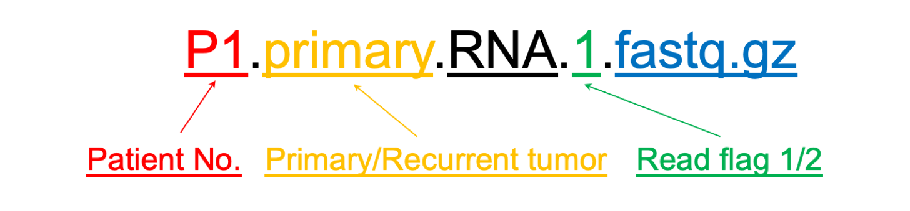

# 2021 Spring - Data Science for Biology and Medicine (LIFS 4320 & BIEN 3320)

## Introduction

This is data page for RNA sequencing data and the reference genome you may use in BIEN 3320 & LIFS 4320. 

## Description

### `RNAseq` folder

- Folder for RNAseq data you may use. There are 40 `*.fastq.gz` files inside. For each sample, the RNA sequencing data is paired (here the read flags are noted as flag 1 and flag 2, meaning that the data of read flag 1 data is paired with data of read flag 2).

- e.g. `P1.primary.RNA.1.fastq.gz` means the compressed fastq RNA sequencing for the primary tumor in patient No.1, with read flag 1.

- e.g. `P1.recurrent.RNA.2.fastq.gz` means the compressed fastq RNA sequencing for the recurrent tumor in patient No.1, with read flag 2.



### `refGeno` folder

- Folder for reference genomes you may use.

- e.g. `chr21.hg37/hg38.fa` are the fasta files of reference genome of hg37/hg38 in chr21

- e.g. `chr21.hg37/hg38.gtf` are GTF files for hg37/hg38 in chr21

## How to download the data

You can try the following command in your terminal and the data will clone to your own folder.

```git clone https://github.com/jligm-hash/2021spring.git```

- As an alternative, it is fine to use any methods that can download the data here (such as use `curl -O`, `wget`, or `directly download the data`). 

## Notes

- When you feed the data to your alignment software, make sure that you feed the paired RNA sequencing for one sample into the alignment software. e.g. The paired RNA sequencing files, `Sample.RNA.1.fastq.gz` and `Sample.RNA.2.fastq.gz`, are the input files for your alignment software.

- You can use any methods to download the data, but one thing you should make sure is that the size should be the same with the data on this page.

- Generally, if the size of the data is right, you don't have to verify the [`MD5 code`](https://en.wikipedia.org/wiki/MD5). But if you would like to verify the `MD5 code` of each file to make sure that data is right, then you can run `MD5 *.gz`. The MD5 of source data is shown here. 

```
# md5 *.gz
MD5 (P1.primary.RNA.1.fastq.gz) = 683403613738fd097341b8b3dffd18c2
MD5 (P1.primary.RNA.2.fastq.gz) = 8cc53d50042fb68ff919e0e859566cce
MD5 (P1.recurrent.RNA.1.fastq.gz) = d87717b71ec5d8d2b439580ed988f900
MD5 (P1.recurrent.RNA.2.fastq.gz) = 093f7389d0dfcf9faca2c6c88ba7aec8
MD5 (P10.primary.RNA.1.fastq.gz) = 101a77b3f8bbb8ebbea7dacd7e7fa1e0
MD5 (P10.primary.RNA.2.fastq.gz) = 17384873fd87298efffd711b5d835e7e
MD5 (P10.recurrent.RNA.1.fastq.gz) = 04d24e527520d477babe91f83e348c2e
MD5 (P10.recurrent.RNA.2.fastq.gz) = a3ab42910dfecb6b58e9044acc8f7796
MD5 (P2.primary.RNA.1.fastq.gz) = 84259ba6ad1e6d8ae1db94704211bb72
MD5 (P2.primary.RNA.2.fastq.gz) = 3612d87e26f66d331d34b5bed55495d2
MD5 (P2.recurrent.RNA.1.fastq.gz) = b40709987ee3ae0d14cd2d94cfe51a99
MD5 (P2.recurrent.RNA.2.fastq.gz) = 2fbf009b109e70163f24523a8d112a22
MD5 (P3.primary.RNA.1.fastq.gz) = a733df2a72c279bb249d251b783b2a41
MD5 (P3.primary.RNA.2.fastq.gz) = 522b14fcdfd2e4c3fcbc949fa3371b4f
MD5 (P3.recurrent.RNA.1.fastq.gz) = 4d3f7ab2a48b185445a16475ae2ef1e6
MD5 (P3.recurrent.RNA.2.fastq.gz) = 6bf2336e8cea0bb23a9ae84186618752
MD5 (P4.primary.RNA.1.fastq.gz) = f41d73b3d4457aed6dda571aa8889491
MD5 (P4.primary.RNA.2.fastq.gz) = 4c8b6efc1a1ee9dd3b896fc08d7d66ba
MD5 (P4.recurrent.RNA.1.fastq.gz) = b40dd4441e434eb13864a973bc22ad21
MD5 (P4.recurrent.RNA.2.fastq.gz) = 298e69491ff87406e3854ccedffd3355
MD5 (P5.primary.RNA.1.fastq.gz) = 1be8400ddf13e6c9c3f1a43930614e47
MD5 (P5.primary.RNA.2.fastq.gz) = 0355a1f1571b17eb76824daf45a8a7bd
MD5 (P5.recurrent.RNA.1.fastq.gz) = e5ebf9640f7955db0a6c6e561a7ac581
MD5 (P5.recurrent.RNA.2.fastq.gz) = c8ca3f2916647d93b39817b7692e053e
MD5 (P6.primary.RNA.1.fastq.gz) = bf90edc09aa61cd7ad54227d819c9402
MD5 (P6.primary.RNA.2.fastq.gz) = 7ac43c7ea9866b0e44f0b54706a21c6a
MD5 (P6.recurrent.RNA.1.fastq.gz) = 1b0f05fc240fb999c15e5def9f22a348
MD5 (P6.recurrent.RNA.2.fastq.gz) = 66d8586cb5e187b022b9f6e17313de6b
MD5 (P7.primary.RNA.1.fastq.gz) = eab87f1a9a392af898c1afdbc82eddf3
MD5 (P7.primary.RNA.2.fastq.gz) = fce783be2f1752dc4c9a2ea87cc2d8d5
MD5 (P7.recurrent.RNA.1.fastq.gz) = 46f27f20a1151d074989420b651587f8
MD5 (P7.recurrent.RNA.2.fastq.gz) = 37996ed1ed589dec21ef393812f3f086
MD5 (P8.primary.RNA.1.fastq.gz) = 0675cb5b7b79fb9f9fd1c33a742656e5
MD5 (P8.primary.RNA.2.fastq.gz) = b5ccb65e1d32a6e2ec706de04ac27b76
MD5 (P8.recurrent.RNA.1.fastq.gz) = 63f126bbe71cb252b9ecb8b223523637
MD5 (P8.recurrent.RNA.2.fastq.gz) = 304dde10228965d42ebf6ca760bc2d8e
MD5 (P9.primary.RNA.1.fastq.gz) = 097ad1ee8d42c5093d5f5d02794af616
MD5 (P9.primary.RNA.2.fastq.gz) = aa556318d74ab7f1b2d1027964c10e5b
MD5 (P9.recurrent.RNA.1.fastq.gz) = ce70a9677b07383e69f5ea6668697e98
MD5 (P9.recurrent.RNA.2.fastq.gz) = a5456ba224a267af9b3a6c9531271a73

# md5sum *.gz
683403613738fd097341b8b3dffd18c2  P1.primary.RNA.1.fastq.gz
8cc53d50042fb68ff919e0e859566cce  P1.primary.RNA.2.fastq.gz
d87717b71ec5d8d2b439580ed988f900  P1.recurrent.RNA.1.fastq.gz
093f7389d0dfcf9faca2c6c88ba7aec8  P1.recurrent.RNA.2.fastq.gz
101a77b3f8bbb8ebbea7dacd7e7fa1e0  P10.primary.RNA.1.fastq.gz
17384873fd87298efffd711b5d835e7e  P10.primary.RNA.2.fastq.gz
04d24e527520d477babe91f83e348c2e  P10.recurrent.RNA.1.fastq.gz
a3ab42910dfecb6b58e9044acc8f7796  P10.recurrent.RNA.2.fastq.gz
84259ba6ad1e6d8ae1db94704211bb72  P2.primary.RNA.1.fastq.gz
3612d87e26f66d331d34b5bed55495d2  P2.primary.RNA.2.fastq.gz
b40709987ee3ae0d14cd2d94cfe51a99  P2.recurrent.RNA.1.fastq.gz
2fbf009b109e70163f24523a8d112a22  P2.recurrent.RNA.2.fastq.gz
a733df2a72c279bb249d251b783b2a41  P3.primary.RNA.1.fastq.gz
522b14fcdfd2e4c3fcbc949fa3371b4f  P3.primary.RNA.2.fastq.gz
4d3f7ab2a48b185445a16475ae2ef1e6  P3.recurrent.RNA.1.fastq.gz
6bf2336e8cea0bb23a9ae84186618752  P3.recurrent.RNA.2.fastq.gz
f41d73b3d4457aed6dda571aa8889491  P4.primary.RNA.1.fastq.gz
4c8b6efc1a1ee9dd3b896fc08d7d66ba  P4.primary.RNA.2.fastq.gz
b40dd4441e434eb13864a973bc22ad21  P4.recurrent.RNA.1.fastq.gz
298e69491ff87406e3854ccedffd3355  P4.recurrent.RNA.2.fastq.gz
1be8400ddf13e6c9c3f1a43930614e47  P5.primary.RNA.1.fastq.gz
0355a1f1571b17eb76824daf45a8a7bd  P5.primary.RNA.2.fastq.gz
e5ebf9640f7955db0a6c6e561a7ac581  P5.recurrent.RNA.1.fastq.gz
c8ca3f2916647d93b39817b7692e053e  P5.recurrent.RNA.2.fastq.gz
bf90edc09aa61cd7ad54227d819c9402  P6.primary.RNA.1.fastq.gz
7ac43c7ea9866b0e44f0b54706a21c6a  P6.primary.RNA.2.fastq.gz
1b0f05fc240fb999c15e5def9f22a348  P6.recurrent.RNA.1.fastq.gz
66d8586cb5e187b022b9f6e17313de6b  P6.recurrent.RNA.2.fastq.gz
eab87f1a9a392af898c1afdbc82eddf3  P7.primary.RNA.1.fastq.gz
fce783be2f1752dc4c9a2ea87cc2d8d5  P7.primary.RNA.2.fastq.gz
46f27f20a1151d074989420b651587f8  P7.recurrent.RNA.1.fastq.gz
37996ed1ed589dec21ef393812f3f086  P7.recurrent.RNA.2.fastq.gz
0675cb5b7b79fb9f9fd1c33a742656e5  P8.primary.RNA.1.fastq.gz
b5ccb65e1d32a6e2ec706de04ac27b76  P8.primary.RNA.2.fastq.gz
63f126bbe71cb252b9ecb8b223523637  P8.recurrent.RNA.1.fastq.gz
304dde10228965d42ebf6ca760bc2d8e  P8.recurrent.RNA.2.fastq.gz
097ad1ee8d42c5093d5f5d02794af616  P9.primary.RNA.1.fastq.gz
aa556318d74ab7f1b2d1027964c10e5b  P9.primary.RNA.2.fastq.gz
ce70a9677b07383e69f5ea6668697e98  P9.recurrent.RNA.1.fastq.gz
a5456ba224a267af9b3a6c9531271a73  P9.recurrent.RNA.2.fastq.gz
```